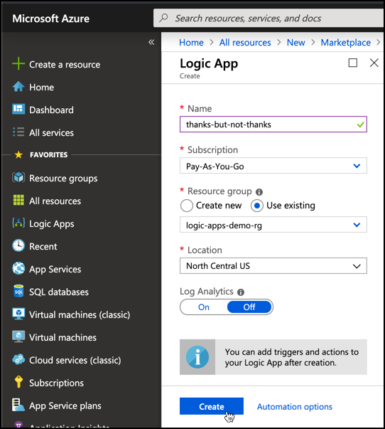
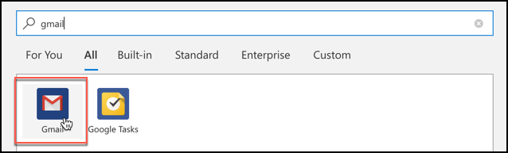
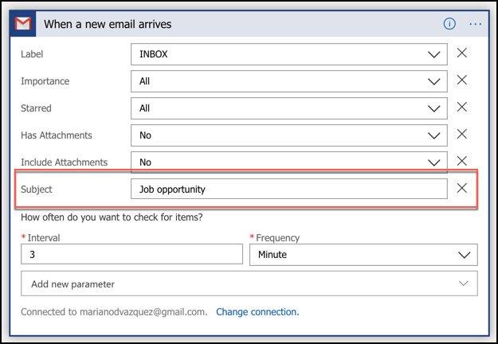
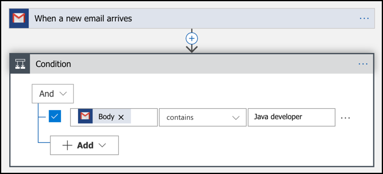
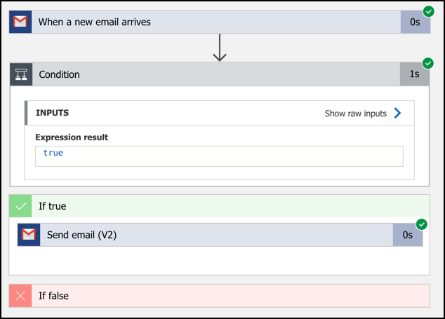

# Azure Logic Apps: automate your email replies with ease

> _Si quieres leer la versión en Español de este artículo, haz click [aqui](./esp.md)._

With Azure Logic Apps, you can quickly build scalable workflows that integrate apps and data of several cloud services and on-premises systems. This post is the second delivery of a series of posts about Azure Logic Apps:

1. [Intro of Azure Logic Apps](./2019-05-01-azure-logic-apps-intro/eng.md).
1. **Easy connecting with know services and send automated replies to emails**, based on customized criteria defined by you.
1. Automating repetitive job tasks to increase productivity.
1. Connecting to different Public Social APIs to develop a piece of your app.

In this post, you will learn how to develop a fully-working application in just a couple of minutes.

### Thanks, but no thanks email reply

Imagine that you want to resolve the following situation:

> _Everyday I get tons of automated emails from job recruiters asking me to start a lengthy process to get a job that, after reading the first line, I notice I'm not qualified to. I'd like to reply to every one of them explaining why I believe I'm not the best fit, but I don't have the time to do it._

Have you ever been in this situation before? In my case, I receive multiple jobs offer for a **Senior iOS Developer**, and I have zero experience in the field! And instead of politely answering each one of these emails, why don't we create an app that will automatically _reply with a "Not interested" message when receiving a Senior iOS Developer job offer in our inbox_ (or similar).

Of course, you can solve this hassle in many ways, but _using an automated solution, you will do it right and only once_. To do so, you first have to analyze the problem by dissecting it into little, manageable pieces. In this case:

1. Create an app that _"starts"_ when an email is received into your email account (e.g. Gmail).
1. This app inspects the email content (subject, body, or both) checking if it contains a specific set of keywords (e.g. "Job opportunity" in the subject and "Java developer" or similar in the body).
1. Send a reply to the sender of the original email respectfully declining the offer, using a predefined message like _Thank you so much for considering me for this position. However, I believe I'm not the right candidate for the job. Please let me know if there is a future opportunity best suited for my current skills and expertise. You can find my CV here: <link-to-your-CV>_.

Although it seems much work just for sending an email reply, with Azure Logic Apps you can create this app in minutes.

#### Creating Azure Logic Apps

1. Navigate to the [Azure Portal](https://portal.azure.com/).
1. In the left pane, click the **Create a resource** button and search for **Logic app**, or [click here](https://portal.azure.com/#create/Microsoft.EmptyWorkflow).
1. Name your new logic app, choose a subscription and click the **Create** button.

   

1. Once your app is created, navigate to its home screen. Scroll down and choose **Blank Logic App** under the _Templates_ section.

   

   > **Note:** if you want to see a great step-by-step walkthrough of Azure Logic Apps, go [here](https://docs.microsoft.com/en-us/azure/logic-apps/quickstart-create-first-logic-app-workflow).

1. Now you are in the **Logic apps designer**. As we mentioned earlier, your app needs to start when an email arrives in your Gmail account. For this, you need to create a Gmail **Trigger**. You do so by typing _"gmail"_ and choosing the first option you see below.

   

   The only **operation** that is available is _"When a new email arrives"_. This is the one we need.

   

1. Click **Sign in** to connect your Gmail account with this app.

   

1. Add a new **Subject** parameter to filter out all emails that don't have the words _"Job opportunity"_ in it. Notice that the app will poll your email inbox _every 3 minutes_ searching for new emails that match these criteria.

   

1. Next, we need to add a condition to identify the emails that contain a predefined set of keywords inside their bodies. For this, click the **+ New step** button, then click the **Built-in** tab, choose the **Control** option and finally pick the **Condition** card.

   Configure an **"AND condition"** to check if the **Body** contains the phrase _"Java developer"_, as shown in the image below:

   

1. Finally, add an action inside the **If true** section to reply with the _best polite predefined answer you can come up with_. I recommend you to use the **Send email (V2)** connector as it uses a simple but yet powerful [WYSIWYG](https://en.wikipedia.org/wiki/WYSIWYG) editor.

   

And that's pretty much it. Click the **Save** button located in the top toolbar and then click **Run** to activate the app. Try sending an email to yourself to validate that everything works. If it does, you will see something like this (pretty neat, right?)

I didn't lie. This could take you up a couple of minutes, but no more than that. Can you provide a rough estimate of how long it would take you to code the same app with the language of your choice? For sure, it will take much more (if it doesn't, [send me a DM](https://twitter.com/nanovazquez87), we are hiring :D)

### Under the hood

If you need to develop this from scratch, regardless of the language or framework you use, your code will have to cover the following topics:

- Interact with the [Gmail API](https://developers.google.com/gmail/api/) to _list_ the latest emails and _send_ a reply email. To implement this part, you will have to read the documentation of this API and test out these endpoints a few times.
- Connect to the end-users' email account on their behalf using the [OAuth 2.0](https://oauth.net/2/) protocol. Azure Logic Apps uses the [Authorization code grant type](https://www.oauth.com/oauth2-servers/access-tokens/authorization-code-request/).
- Run periodically (every X minutes). You can either code this, execute a cron job, or else. But you must guarantee its periodical execution somehow.
- Contain business logic to cover some dynamic conditions based on configurable keywords.
- It has to be redeployed automatically on every code change.

Now that you have read all of this, how long would you think it would take you to develop the app? And, how long do you think it would take to a developer with little/no expertise in any of these topics? Definitely more than a couple of minutes, right? And one more, what would happen with your estimations if we now want to use _Outlook_ instead of _Gmail_?

As you see, Azure Logic Apps is the right choice for rapid development with little or no code, even for novice or advanced developers. In the next posts, we will analyze more capabilities of this Azure Service by implementing new use cases. Stay tuned!

🎉🎉
