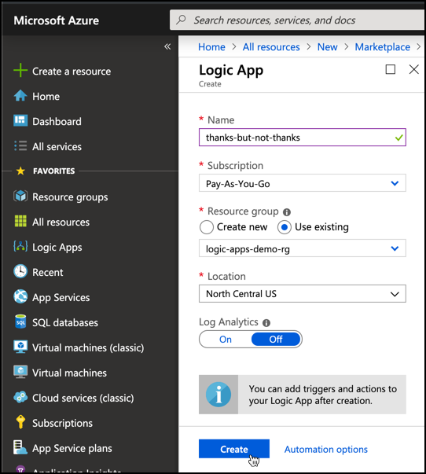
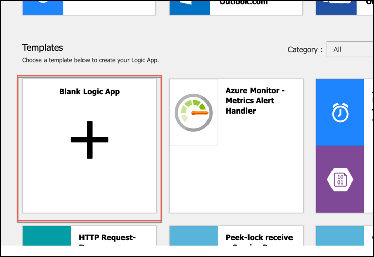
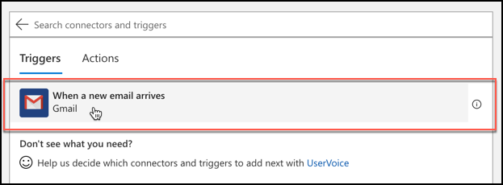
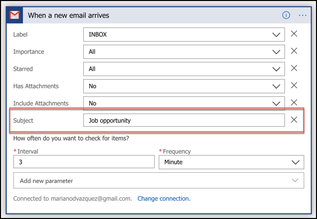
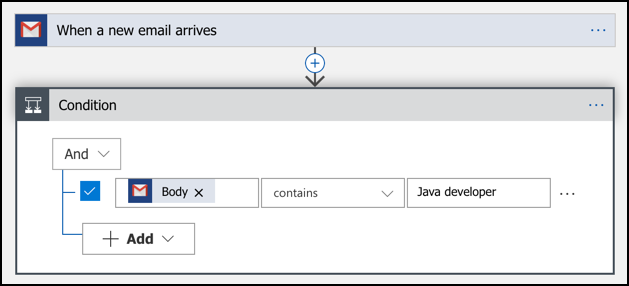
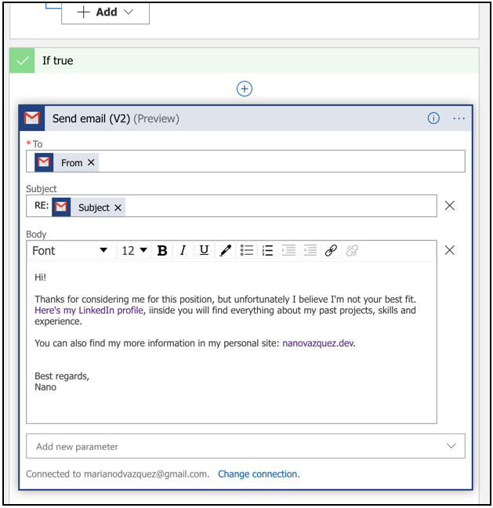
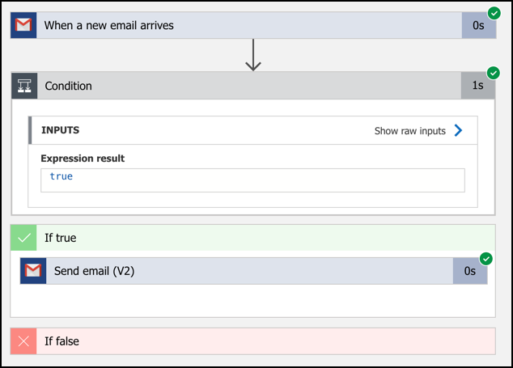

# Azure Logic Apps: automatiza el envío de emails con en unos pocos pasos

> _If you want to read the English version of this article, click [here](./eng.md)_.

Con Azure Logic Apps uno puede construir rápidamente Workflows escalables para integrar aplicaciones y datos de múltiples servicios en la nube o sistemas on-premise. Este post es la segunda entrega de una serie de posts sobre Azure Logic Apps:

1. [Introducción a Azure Logic Apps](./2019-05-01-azure-logic-apps-intro/esp.md).
1. **Automatiza el envío de emails y respuestas en unos pocos pasos**, basado en criterios customizables.
1. [Cómo automatizar tareas repetitivas para incrementar tu productividad.](../2019-11-16-azure-logic-apps-sfdc-automation/esp.md)
1. Cómo conectarse a diferentes APIs sociales para desarrollar una pieza de tu aplicación.

En este post, vamos a aprender cómo desarrollar una aplicación completamente funcional en unos minutos.

### Email tipo "Gracias, pero no gracias"

Imagina que quieres resolver la siguiente situación:

> _Todos los días recibo decenas de emails de ofertas laborales las cuales, al leer la primera línea, me doy cuenta de que no tienen nada que ver con mi experiencia o capacidades. Me encantaría poder responder a cada uno de estos emails explicando la razón por la cual creo no ser el candidato que buscan, pero no tengo el tiempo suficiente para hacerlo_.

Alguna vez has estado en esta situación? En mi caso personal, suelo recibir múltiples ofertas laborales para **Senior iOS Developer**, y tengo cero años de experiencia en iOS! En vez de responder estos emails uno por uno, por qué no creamos una aplicación que responderá con un mensaje predefinido cada vez que reciba este tipo de emails?

Por supuesto que este problema puede resolverse de muchas maneras, pero _si utilizas una solución automatizada vas a lograr resolverlo correctamente una sóla vez_. Y después reutilizar esa solución en el futuro. Para ello, lo primero que debes hacer es dividir el problema en pequeñas piezas manejables:

1. Crear una aplicación que _"comienza"_ cuando un email es recibido en tu casilla de correo (por ejemplo, Gmail).
1. La aplicación inspeccionará el contenido del mail (el Asunto, el contenido, o ambos) y, si contiene alguna keyword específica (por ejemplo, "Oportunidad laboral" en el Asunto y/o "Desarrollador java" en el contenido).
1. Si el criterio anterior se cumple, se enviará un email al emisor del mail original, declinando la oferta laboral con un mensaje predefinido tipo: _"Muchas gracias por considerarme para esta posición, pero creo que no soy el candidato correcto para el trabajo ofrecido. Por favor, manténgame al tanto si es que surge una nueva oportunidad laboral que requiera de mis skills y esperiencia, pueden encontrar mi CV aquí: <link-a-tu-CV>._

Aunque parezca un montón de trabajo sólo para enviar una respuesta automática por email, con Azure Logic apps podes crear esta aplicación en minutos:

#### Creando la app de Azure Logic apps

1. Navegar al [Azure Portal](https://portal.azure.com/).
1. En el panel de la izquierda, clickear en el botón **Create a resource** y luego buscar por la opción **Logic app**, o [clickear aquí](https://portal.azure.com/#create/Microsoft.EmptyWorkflow).
1. Define un nombre para tu nueva logic app y clickea en el botón **Create**.

   

1. Una vez que tu app haya sido creada, navega a su pantalla principal. Verás varios templates para crear, para este caso elige la opción **Blank Logic App**.

   

   > **Note:** si quieres seguir una explicación "paso a paso" sobre cómo crear una Azure Logic App, haz click [aquí](https://docs.microsoft.com/en-us/azure/logic-apps/quickstart-create-first-logic-app-workflow).

1. Ahora te encuentras en el **Logic apps designer**. Como mencionamos anteriormente, la aplicación comenzará cuando llegue un email a tu casilla de correo de Gmal. Para esto, debes crear un **Trigger** de Gmail. Puedes hacer eso fácilmente tipeando _"gmail"_ y luego eligiendo la primera opción que se muestra en la sección inferior.

   

   La única **operación** disponible es _"When a new email arrives"_. Esta es la opción que necesitamos utilizar.

   

1. Ahora, haz click en **Sign in** para conectar tu cuenta de Gmail con esta aplicación.

   

1. Agrega un nuevo parámetro **Subject** para filtrar todos los emails que no contienen la frase _Job opportunity_. Notar que la aplicación revisará tu casilla cada 3 minutos, buscando nuevos emails que cumplan esta condición.

   

1. Lo siguiente es agregar una condición para identificar los emails que contienen un set predefinido de keywords en su contenido. Para esto, haz click en el botón **+ New step**, luego en el tab **Built-in** elige la opción **Control** y finalmente elige **Condition**.

   Agrega la **condición AND** **Body** que buscará la frase _"Java developer"_ en el **Body** del email, como se detalla en la siguiente imagen:

   

1. Finalmente, agrega una acción dentro de la sección **If true** para enviar la _mejor y más diplomática respuesta predefinida que se te pueda ocurrir_. Recomiendo que utilices el conector **Send email (V2)** para esto, ya que utiliza un simple pero bastante poderoso editor [WYSIWYG](https://en.wikipedia.org/wiki/WYSIWYG):

   

Y eso es todo! Haz click en el botón **Save** ubicado en la barra superior, y luego haz click en **Run** para activar tu aplicación. Puedes probarla enviándote un email a ti mismo con las keywords que elegimos. Si funciona, vas a ver algo como lo que se muestra a continuación:

No es mentira, todos estos pasos llevan un par de minutos, y no mucho más. Puedes estimar cuanto llevaría implementar la misma aplicación "desde cero" (con el lenguaje que quieras)? Estoy seguro que mucho más que unos minutos (y si no es así, [enviame un DM](https://twitter.com/nanovazquez87), estamos contratando :D)

### Under the hood

Si tienes que desarrollar este tipo de aplicaciones "desde cero", sin importar el lenguaje o framework a utilizar, tu código deberá cubrir los siguientes tópicos:

- Deberá utilizar la [API de Gmail](https://developers.google.com/gmail/api/) para _listar_ los últimos emails _enviar_ un email de respuesta. Para implementar esta parte Deberás leer la documentación de esta API y probar sus endpoints un par de veces.
- Deberá conectarse a la cuenta de los usuarios finales de la aplicación utilizando el protocolo [OAuth 2.0](https://oauth.net/2/). Azure Logic Apps utiliza el [Authorization code grant type](https://www.oauth.com/oauth2-servers/access-tokens/authorization-code-request/).
- Deberá ejecutarse periódicamente cada X minutos. Puedes codear esto, ejecutar un cron job, etc. Pero debes garantizar, de alguna manera, esta ejecución periódica.
- Deberá contener lógica de negocio para poder interpretar múltiples condiciones dinámicas basadas en "keywords" configurables.
- Deberá redeployarse automáticamente con cada cambio en el código.

Luego de leer todo esto, cuánto crees que te llevará a ti implementar la aplicación? Y cuánto crees que le llevará a un desarrollador que no tiene experiencia en alguno de estos temas? Definitivamente mucho más que unos pocos minutos, no? Y una más, qué pasaría con tus estimaciones si ahora queremos utilizar _Outlook_ en vez de _Gmail_?

Como puedes ver, Azure Logic Apps es la opción correcta para un desarrollo rápido que requiera poco o nada de código, aún para desarrolladores principiantes o avanzados. En posts futuros, vamos a analizar más capacidades de este servicio de Azure al implementar nuevos casos de uso. Nos vemos pronto!

🎉🎉
