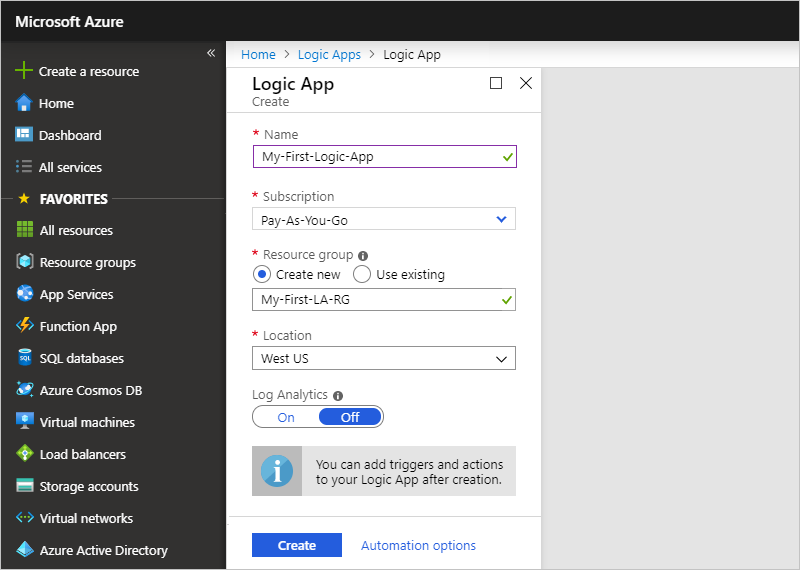
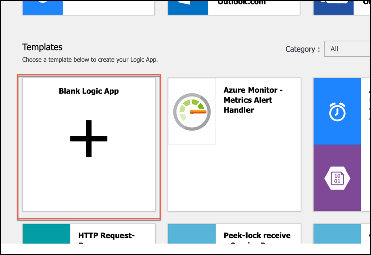
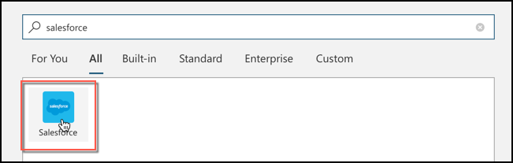
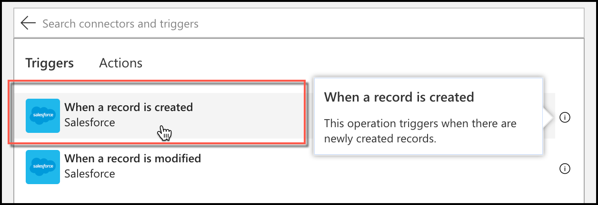
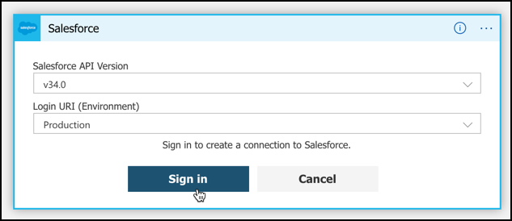
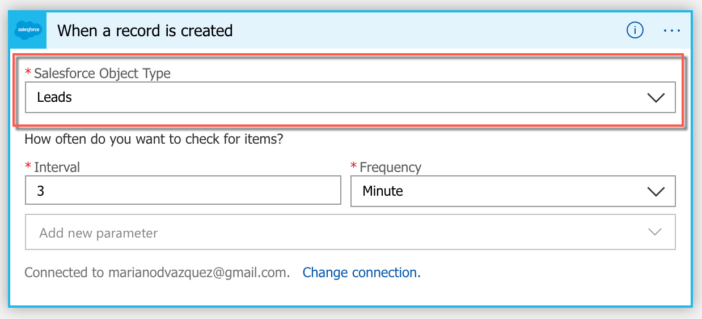
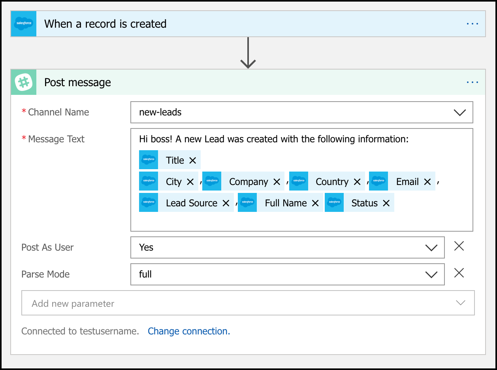
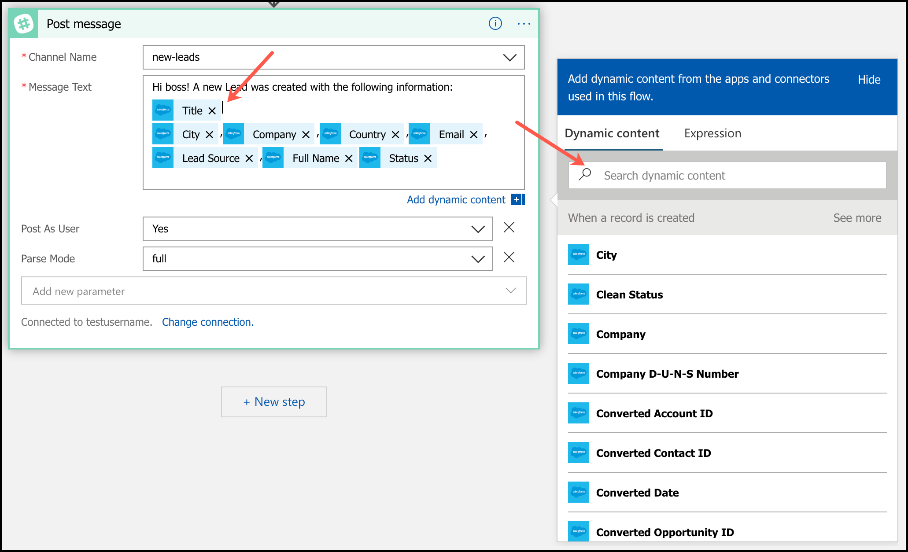
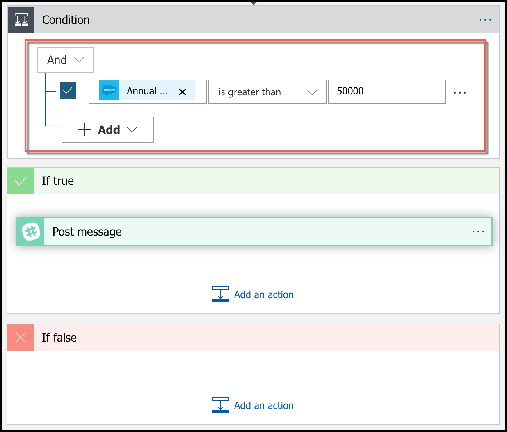

# Azure Logic Apps: automating repetitive tasks to increase your productivity

> _Si quieres leer la versión en Español de este artículo, haz click [aqui](./esp.md)._

With Azure Logic Apps, you can quickly build scalable workflows that integrate apps and data of several cloud services and on-premises systems. This post is the second delivery of a series of posts about Azure Logic Apps:

1. [Intro of Azure Logic Apps](../2019-05-01-azure-logic-apps-intro/eng.md).
1. [Easy connecting with know services and send automated replies to emails, based on customized criteria defined by you.](../2019-06-15-azure-logic-apps-email-automation/eng.md)
1. **Automating repetitive job tasks to increase your productivity.**
1. Connecting to different Public Social APIs to develop a piece of your app.

In this post, you will learn how to develop a fully-working application in just a couple of minutes.

### Gotta catch'em all (the leads)

We are going to put on Sarah's hat, an employee of a small firm in Austin, Tx. Sarah and her coworkers use Salesforce to register all information related to their business, and Slack to communicate within the company.

Sarah's boss wants to track all people who expressed interested in their business, and the actions they've made to convert that _opportunity_ into a real sales operation. For this, they create a _Lead_ in Salesforce, with all the information they have about the customer. But her boss doesn't have time to review all this info in real-time. As such, Sarah and her coworkers have to notify directly to their boss all changes in these _Leads_, which duplicates their daily work.

Sarah has an idea to automate this, let's hear it.

> _Every time we create or update a Lead in Salesforce, why don't we automate the delivery of a Slack message to our sales channel with the new information?_

How hard would that be? Well.. as you might have figured out, with Azure Logic Apps you can integrate these two systems in a couple of minutes.

#### Creating the Azure Logic App

1. Navigate to the [Azure Portal](https://portal.azure.com/).
1. In the left pane, click the **Create a resource** button and search for **Logic app**, or [click here](https://portal.azure.com/#create/Microsoft.EmptyWorkflow).
1. Name your new logic app, choose a subscription, and click the **Create** button.

   

1. Once your app is created, navigate to its home screen. Scroll down and choose **Blank Logic App** under the _Templates_ section.

   

   > **Note:** if you want to see a great step-by-step walkthrough of Azure Logic Apps, go [here](https://docs.microsoft.com/en-us/azure/logic-apps/quickstart-create-first-logic-app-workflow).

1. Now you are in the **Logic apps designer**. Search for the **Salesforce** trigger and choose it.

   

   This trigger has two options available to initiate our app. Choose **When a record is created**.

   

   > **Note:** due to only one trigger can be chosen, Sarah will have to create two apps if she wants to generate a message every time a _Lead_ is created and modified.

1. Connect your Salesforce account with the Logic app by clicking the **Sign in** button.

   

   > **Note:** in case you don't have a Salesforce account, you can create a Developer account by clicking [here](https://developer.salesforce.com/signup).

1. Now configure the Salesforce trigger to activate when new **Leads** objects are created. Notice that the app will check for new entities in your Salesforce account _every 3 minutes_.

   

1. Next, click the **Next step** button and configure a new **Slack** action in your app to **Post a message** after a **Lead** is created. This message could, for example, be posted with your user to the _#new-leads_ channel, and contain all the information related to the new _Lead_.

   

   In case you are wondering about the blue boxes, they represent **dynamic content** that we added to the Slack message. You can add any content that comes as a result of the previous actions in your app. In this example, we have access to the full range of properties a _Salesforce Lead_ contains.

   

And that's it! In just a couple of minutes, Sarah (and you) has created a fully-functional app that _will send a Slack message every time a Salesforce Lead is created_.

### Feature request

The boss is really amazed by what Sarah did. But, like all bosses, she now wants something extra. She only wants to receive notifications **for Leads with an annual revenue greater than 50k**, as she doesn't want to be bothered with the rest. Is it possible?

Of course it is! It's just a matter of adding a **condition** before sending the _Slack message_, executing this action _only_ if this new critera is met. [We have already learned how to do so in the previous post](../2019-06-15-azure-logic-apps-email-automation/eng.md).

As we have seen, Azure Logic Apps is the right choice for rapid development of applications crafted by people with little/no coding experience. In the next posts, we will focus on more complex use cases best suited for advanced developers. Stay tuned!

🎉🎉🎉
