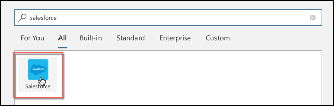
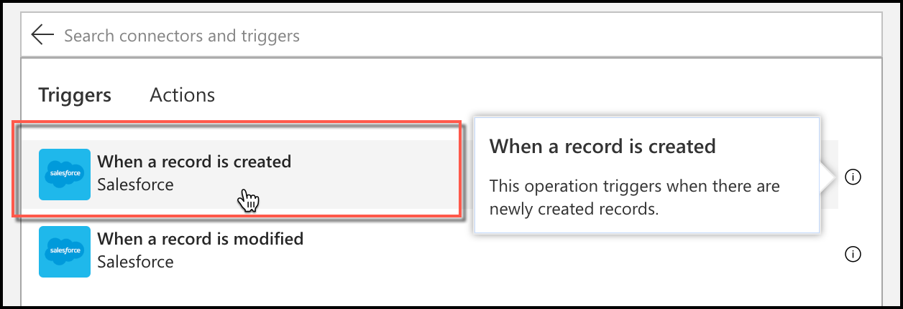
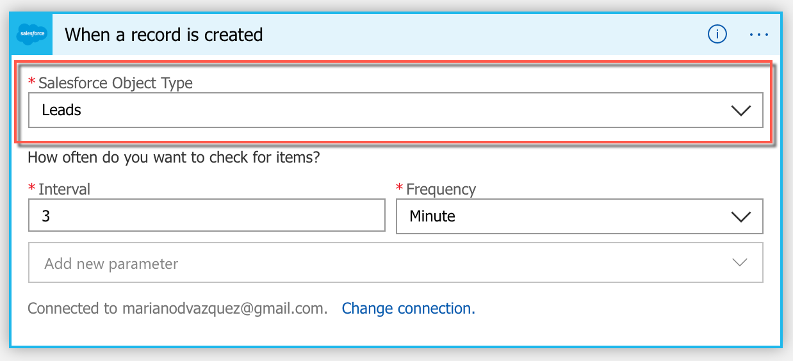
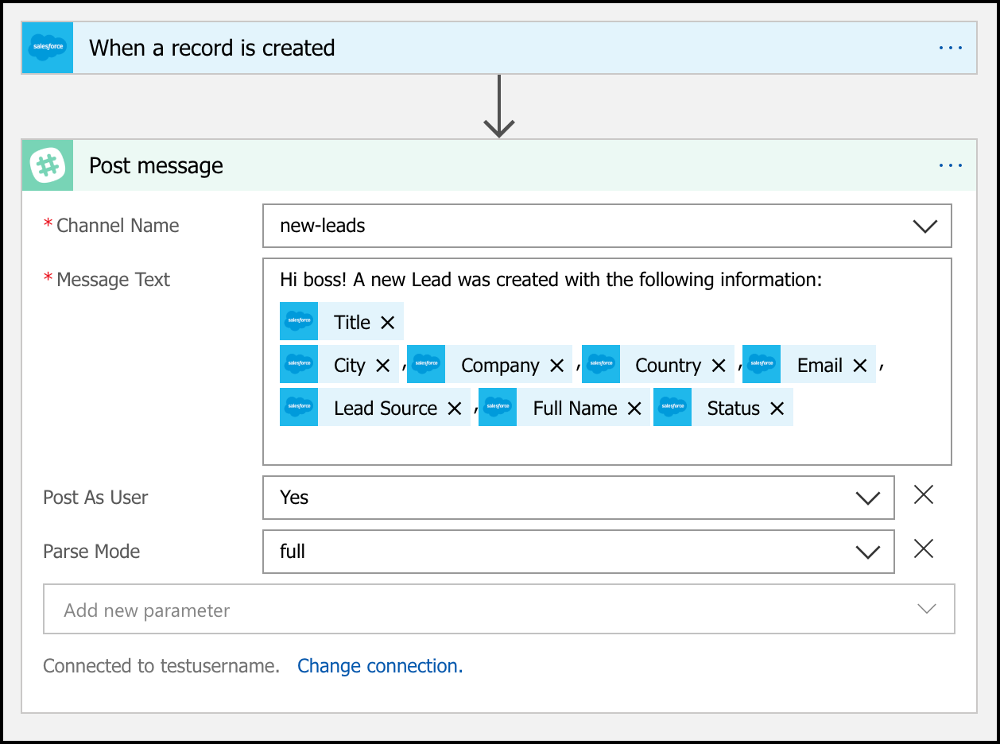
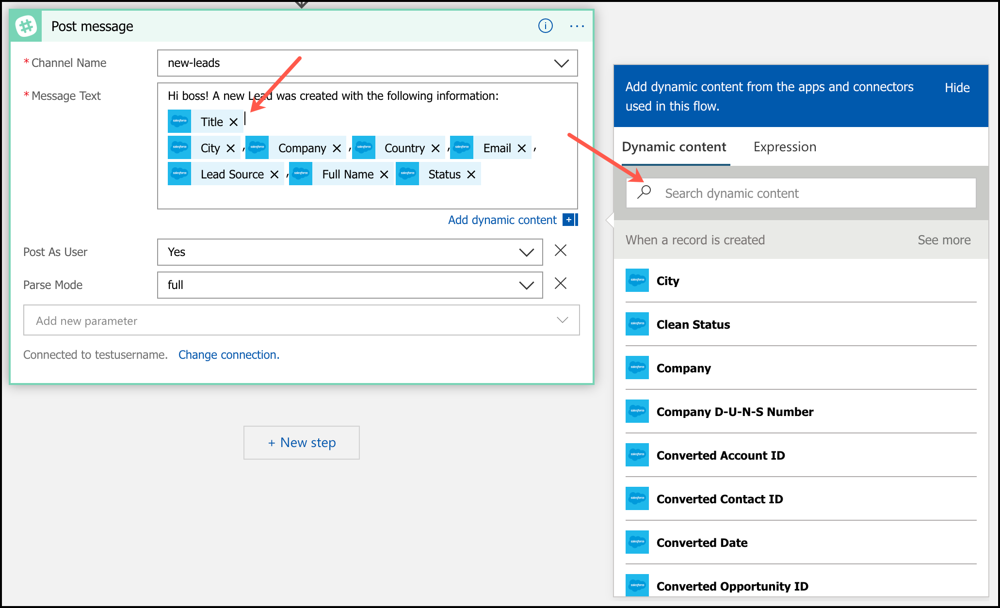

# Azure Logic Apps: automatiza tareas repetitivas para incrementar tu productividad

> _If you want to read the English version of this article, click [here](./eng.md)_.

Con Azure Logic Apps uno puede construir rápidamente Workflows escalables para integrar aplicaciones y datos de múltiples servicios en la nube o sistemas on-premise. Este post es la segunda entrega de una serie de posts sobre Azure Logic Apps:

1. [Introducción a Azure Logic Apps](./2019-05-01-azure-logic-apps-intro/esp.md).
1. [Automatiza el envío de emails y respuestas en unos pocos pasos, basado en criterios customizables.](../2019-06-15-azure-logic-apps-email-automation/esp.md))
1. **Cómo automatizar las tareas repetitivas de tu trabajo e incrementa tu productividad.**
1. Cómo conectarse a diferentes APIs sociales para desarrollar una pieza de tu aplicación.

En este post, vamos a aprender cómo desarrollar una aplicación completamente funcional en unos minutos.

### Gotta catch'em all (los Leads)

Vamos a ponernos en el rol de Sara, una empleada de un pequeño comercio de Austin, Texas. Sarah y sus compañeros de trabajo utilizan Salesforce para registrar toda la información relacionada a su negocio, y Slack para comunicarse dentro de la compañía.

Su jefa quiere tener registro de todas las personas que expresan un interés en su negocio, y las acciones que hicieron para convertir esa _oportunidad_ en una verdadera operación de venta. Para esto, en la empresa crean una _Lead_ en Salesforce, con toda la información que tienen sobre el potencial cliente. Pero su jefa tampoco tiene tiempo para revisar toda esta información en tiempo real. Por eso, Sara y sus compañeros de trabajo tienen que notificar directamente a su jefa todos los cambios en estos _Leads_, lo cual duplica su trabajo diario.

Sara tiene una idea para automatizar esto, esuchémosla:

> _Cada vez que creamos o actualizamos un Lead en Salesforce, por qué no automatizamos el envío de un mensaje a nuestro canal de ventas en Slack con la nueva información?_

Qué tan difícil puede ser esto? Bueno.. como ya debes haber deducido, con Azure Logic Apps puedes integrar estos dos sistemas en un par de minutos.

#### Creando la Azure Logic app

1. Navegue al [Azure Portal](https://portal.azure.com/).
1. En el panel de la izquierda, haz click en el botón **Create a resource** y luego busque la frase **Logic app** y selecciónela, o [haz click aquí](https://portal.azure.com/#create/Microsoft.EmptyWorkflow).
1. Define un nombre para tu nueva logic app y clickea en el botón **Create**.

   

1. Una vez que tu app haya sido creada, navega a su pantalla principal. Verás varios templates para crear, para este caso elige la opción **Blank Logic App**.

   

   > **Note:** si quieres seguir una explicación "paso a paso" sobre cómo crear una Azure Logic App, haz click [aquí](https://docs.microsoft.com/en-us/azure/logic-apps/quickstart-create-first-logic-app-workflow).

1. Ahora te encuentras en el **Logic apps designer**. Utiliza el buscador para encontrar el **Trigger** de Salesforce y elígelo.

   

   Este trigger tiene dos opciones disponibles para iniciar tu aplicación. Elige la opción **When a record is created**.

   

   > **Note:** dado que sólo un trigger puede ser elegido, Sara tendrá que crear dos aplicaciones diferentes si quiere recibir notificaciones cada vez que un _Lead_ es creado o modificado.

1. Conecta tu cuenta de Salesforce con la Azure Logic app al clickear en el botón **Sign in**.

   

   > **Note:** en caso de que no tengas una cuenta de Salesforce, puedes crear una cuenta de desarrollador clickeando [aquí](https://developer.salesforce.com/signup).

1. Ahora, configura el trigger de Salesforce para que tu aplicación se active cada vez que un objeto **Leads** es creado. Ten en cuenta que la aplicación va a chequear por nuevas entidades en tu cuenta de Salesforce _cada 3 minutos_.

   

1. Luego, haz click en el botón **Next step** y configura una acción de **Slack** llamada **Post a message** para enviar un mensaje luego de que un **Lead** es creado. Este mensaje podría, por ejemplo, ser posteado por tu usuario en el canal _#new-leads_, conteniendo toda la información relacionada a ese nuevo _Lead_.

   

   En caso de que te estes preguntando que son esas cajas azules, éstas representan **contenido dinámico** que hemos agregado al mensaje de Slack. Puedes agregar cualquier contenido que viene como resultado de las acciones previas en tu aplicación. En este ejemplo tenemos acceso al rango completo de propiedades que contiene un _Lead de Salesforce_.

   

Y eso es todo! En sólo unos minutos, Sara (y vos) ha podido crear una aplicación completamente funcional que _enviará un mensaje a Slack cada vez que se cree un nuevo Lead en Salesforce_.

### Pedido de mejora

La jefa está realmente sorprendida por lo que hizo Sara. Pero, como todos los jefes, ahora quiere algo extra. Sólo quiere recibir notificaciones de **Leads con una ganancia anual (annual revenue) mayor a 50k**, dado que son las más prioritarios para la companía. Es esto posible?

Por supuesto que lo es! Sólo requiere agregar una **condición** antes de enviar el _mensaje de Slack_, ejecutando esta acción _sólo_ si se cumple este nuevo criterio. [Ya hemos aprendido cómo hacer esto en el post previo](../2019-06-15-azure-logic-apps-email-automation/eng.md).

Como hemos visto, Azure Logic Apps es la opción correcta para el desarrollo rápido de aplicaciones hechas por persona con poca/ninguna experiencia en programación. En los posts siguientes, vamos a enfocarnos en casos de uso más complejos orientados a desarrolladores avanzados. Esten atentos!

